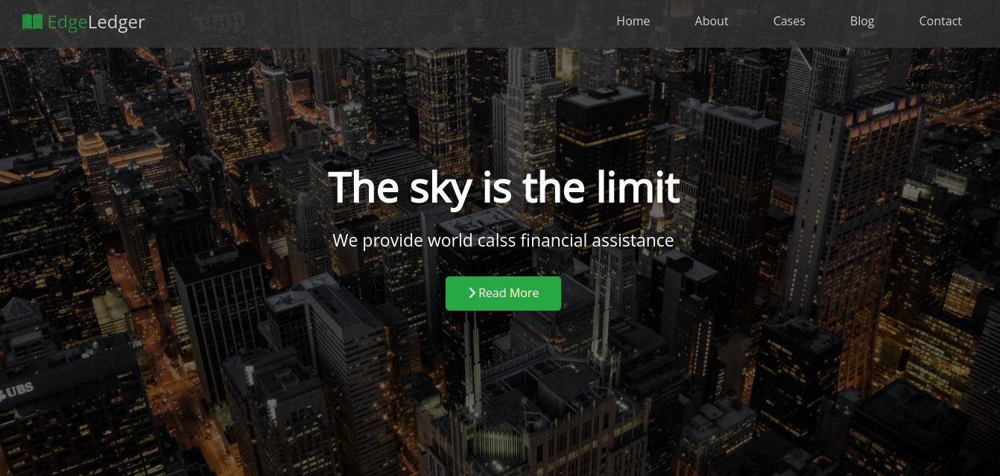

# EdgeLedger

A simple HTML/CSS project practicing CSS Flexbox layout.

## Overview

EdgeLedger is a demo website consisting of five sections:

1. Home
2. About
3. Case Studies
4. Blog
5. Contact

Each section is styled using CSS Flexbox to create a responsive and visually appealing layout.

## Preview



## Live Demo

[Live Demo](https://edgeledger-demo.netlify.app/)

## Usage

To run this project locally, simply clone the repository and open the `index.html` file in your web browser.

```bash
git clone https://github.com/Islam-Sobhy-Yousof/EdgeLedger.git
cd EdgeLedger
